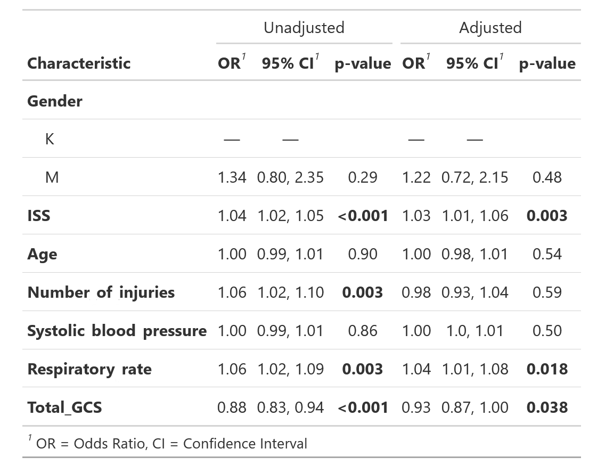

# Introduction

## Definition

Trauma, defined as the clinical entity composed of physical injury and
the body's associated response [@gerdin_risk_2015], is and has long been
a major cause of death around the world [@WHO_2021]. Within modern
hospital care, the trauma system stands as an important part in
healthcare and is crucial to lowering mortality and morbidity in injured
patients through many means, such as hospital care, patient follow up
and prevention programs [@Choi_2021].

## Trauma Statistics

Trauma is often divided into two subgroups, blunt force trauma and
penetrating trauma. Blunt force trauma is when an object or force
strikes the body, often causing bruising, broken bones or deep cuts.
Examples of blunt trauma could be car crashes, falls or direct blows to
the body. Penetrating trauma is when an object pierces the skin or body
and creates an open wound. Examples of penetrating trauma are gunshot
wounds and stab wounds [@NIGMS_2020]. Differences exist between the two
groups, as blunt trauma patients tend to be more injured on arrival to
the hospital and as such, require more resources and are hospitalized
for a longer periods [@FITCH2019].

Today, trauma takes the lives of around 4,4 million people each year,
almost 8% of all deaths [@WHO_2021]. In the United States, trauma is the
4th leading cause of death among the general population and the leading
cause for people between the ages of 1 and 44 [@AAST_2020]. It is also
an important cause of hospitalization and morbidity among all age
groups, including seniors, and is responsible for an estimated 10% of
all years lived with a disability globally. This has a significant
burden on social and economic level, costing countries billions of US
dollars each year in healthcare and lost productivity [@connolly_2018].
Studies estimate the cost of trauma care being between 18,500\$ and
41,500\$ per patient in high income countries (HIC), depending on the
country [@Willenberg_2012]. However, it has been shown that this burden
is not evenly distributed between or within countries. Many social
factors such as age, sex and social status play a major role in the risk
of dying from trauma, with young men with low socio-economic status
being at most risk [@WHO_2021]. But it is not only patient level factors
that affect what effect trauma has on people. About 90% of all trauma
related deaths occur in low- and middle-income countries (LMIC), with
death rates by trauma also being higher than in HIC. Even within these
LMIC, people of poorer socio-economic status have higher death rates
from trauma. Problems identified within these countries that contribute
to these statisitics were infrastructure, education and training,
attributed to lack of funding, brain drain to HIC and lack of
availability of basic amenities [@Shanthakumar_2021]. In HIC where
funding and governance over the healthcare system is better designed,
functioning trauma systems and dedicated trauma centers exist that have
been shown to lower mortality but also improve functional outcome in
trauma patients [@Nirula_2006].

## Trauma systems

Trauma systems are infrastructures that exist to provide and optimize
care for injured patients starting with injury recognition and triage,
transport to appropriate trauma center, inpatient care and outpatient
follow-up. Beyond the clinical side, trauma systems work with outreach,
education and advocacy, data collection through registries, research,
funding, and disaster preparedness and response. A comprehensive and
functioning trauma system requires strong leadership and engagement at
the trauma center, regional and national level [@connolly_2018]. This
system is crucial to provide care for trauma patients, both in reducing
morbidity and mortality in this patient group. Earlier studies from
Sweden have shown that treating severely injured patients at a trauma
center is associated with a 41% lower adjusted 30-day mortality rate
compared to being treated at a non trauma care center due to them being
more capable of treating these patients, with potential survival benefit
increasing with higher injury severity [@Candefjord_2020]. Other studies
have shown similar results, showing that treating injured patients at
trauma centers is associated with a 15-30% decrease in mortality
[@Moran_2018; @Celso_2006; @MacKenzie_2006; @Haas_2012] . During the
last three decades, the introduction of trauma systems has contributed
to lowering the incidence of preventable death . This is attributed to
the improvements in care for acute brain injuries and bleeding control.
The incidence of late death because of sepsis and multiple organ failure
has also been lowered, possibly a result of better and earlier
resuscitation [@Asensio_2008]. Functioning trauma systems saves lives in
the hospital, but their work outside of the hospital is just as
important. Data collection from injured patients, such as mechanism of
injury or mortality, are essential for creating databases that can be
used for research. In turn, that research can be used for planning
injury prevention programs that target the most common injuries in the
most efficient ways, e.g. teen drivers, children, specific occupations
etc. These injury prevention programs can be planned on trauma center,
organizational or government level[@ACS].

Trauma teams are multidisciplinary and operate in these centers. They
play a pivotal role in the treatment of the trauma patient, as they
provide the initial care in the critical stage of trauma. In Sweden,
trauma teams are lead by a team leader who is a surgeon, and include
practitioners from the specialities of intensive care, orthopedics,
nursing and support staff[@västra_G]. For the trauma team to be
mobilized, trauma code has to be activated, often by an emergency nurse.
The nurse uses information gathered by the first responders to assess if
the patient fits any of the criteria for trauma code. Most healthcare
facilities have established criteria or guidelines that trigger trauma
code activation. These criteria typically include mechanisms of injury,
physiological criteria, anatomical criteria and other specific
indicators of severe trauma. There are different levels of trauma code
with different criteria correlating with severity of injury, with level
1 mobilizing the most personnel to the trauma room. Once in the trauma
room, the team works systematically to manage the patients injuries.
They handle the most urgent problems first, such as airways and
breathing, with the aim to rapidly assess and stabilise the patient,
prioritise their injuries and arrange for site of definitive care.
[@Hedberg_2020]

## Mortality and morbidity (MoM) conferences

Many hospitals have a trauma registry where they log the patients
information and timeline of what happened. The extent of the registry
varies, with HIC having more complete registries. In Sweden, 48 out of
the 49 hospitals receiving trauma patients are connected to the national
registry SweTrau, which functions as a national database designed to
enable scientific processing with epidemiological technology
[@SweTrau_2021] This logging of information is important work, as a
cornerstone of trauma quality improvement programs is multidisciplinary
MoM conferences. The MoM conference is a meeting where different
specialities who work with trauma care sit down and discuss deaths and
complications in order to look for preventable factors. These
conferences are performed in many hospitals globally, almost everywhere
where there are formal medical specialty departments and sometimes in
smaller hospitals as well [@WHO_2009]. In Sweden, many hospitals have
mortality conferences on deceased patient cases, but only one has MoM
conferences to better their trauma care on patients who lived
[@SweTrau_2023]. The reason being that this expansion of MoM conferences
takes time and resources, which is why all hospitals don't implement
this.

The endpoint of these MoM conferences are opportunities for improvement
(OFI). At the end of the conference, consensus is reached regarding the
existence of an OFI and implementation of corrective action. This
process is effective, as it has been shown that this review is
associated with high-quality trauma care [@Santana_2014]. Examples of
OFI may include lack of resources and management errors. One common OFI
is delayed treatment. According to previous studies, among the
preventable or possibly preventable deaths in trauma patients, delay in
treatment has been identified as a major error contributing to death,
found in up to 52.9% of patients in said group [@Teixeira_2007]. Delayed
treatment has been shown to have adverse effects on patients, showing
why it is such an important issue and the need to develop strategies to
combat [@Sampalis_1995; @Sampalis_1994]. Although it is such a common
OFI, the patient level factors associated with delayed treatment are
poorly understood. There may be several factors that correlate with
receiving delayed treatment, but they have yet to be identified. Mapping
these factors may help in identifying patients that might be at risk for
receiving delayed treatment before it happens.

## Aim

The aim of this paper is to determine what different patient level
factors affect the risk of receiving delayed treatment at a trauma
center.

# Methods

## Setting

Karolinska University hospital, which is the equivalent of a trauma
level 1 hospital, admits 1500 trauma patients each year. To be added to
the trauma registry, a patient must be over 15 years of age, had ISS\>9
and/or had trauma code activation. They get added to both the Karolinska
Trauma registry as well as the national trauma registry (SweTrau). The
registry includes data on vital signs, injuries, interventions and
patient information. Another database, the trauma care quality database
includes information relevant for MoM conferences. At Karolinska
University Hospital, patients who die during hospital stay gets their
case sent to a MoM everytime. However, for the rest of the patients, two
specialized nurses determine whether they are. Several audit filters are
set up to flag for patients with possible OFIs. Flagged patients are
then reviewed by these two nurses who decide if there is a possible OFI,
in which case their case is sent to a MoM conference for further review.

## Study design

We conducted a registry based cohort study using data from the trauma
registry and trauma care quality database at the Karolinska University
Hospital in Solna. The trauma registry includes about 14,022 patients
treated between 2012 and 2022. The trauma care quality database is a
subset of the trauma registry and includes about 8000 patients selected
for review between 2013 and 2022. This project will link the two
databases and assess how different patient level factors, such as age,
sex, blood pressure, and injury severity, are associated with delayed
treatment using logistic regression.

## Outcome

The outcome is delayed treatment, as identified by the multidisciplinary
review board and recorded in the trauma care quality database. The
outcome we'll be using is "long time untill CT" and "long time until
operation", which will be referred to as delayed treatment from now on.

## Participants

The database only includes patients 15 years old and above, ISS \>9
and/or trauma team activation. Inclusion in the study further requires
that the patients have been assessed for OFIs. Patients were excluded if
they were missing information in one of the examined patient factors.

## Variables

The outcome is delayed treatment as identified by the multidisciplinary
review board and recorded in the trauma care quality database. The
independent variables are gender, highest hospital care level, GCS on
arrival, respiratory rate on arrival, systolic blood pressure on
arrival, if the patient was intubated on arrival, whether they arrived
during weekend or working hours, ISS and age. Of these variables, GCS,
respiratory rate, systolic blood pressure, intubation, ISS and age are
used as continuous variables in the analysis

## Data sources/measurement

The data comes from the trauma registry and trauma care quality
database.

## Bias

Selection bias as this is a retrospective cohort study where the outcome
has occurred.

Misclassification bias as the conference may reach a consensus that is
wrong.

## Study size

The study size is all of the eligible patients that was treated at the
hospital between 2012 and 2022. Starting 2013 only a subgroup of
patients were screened for OFIs, but starting 2017 all patients that are
included in the database are screened for OFIs. During this period, 72
patients were deemed to have received delayed treatment.

## Statistical methods

Multivariable and univariable logistical regression. A 5% significance
level and 95% confidence levels will be used.

Rstudio was used to perform the logistical regression. The code was
written to clean and prepare the data from the database. The data was
processed to have the variables customized to fit into the logistical
regression model, such as making them into factors, renaming outcomes in
the database and removing unknown values.

Using the one in ten rule, 7 independent variables were used for the
logistical regression given that we have 72 patients with delayed
treatment. The one in ten rule states that for every variable examined,
10 events are needed in the group. In this case, this means that because
we have 72 patients with the examined outcome, we can have 7 variables.
As we had more variables we wanted to use in the regression model, we
decided to run two logistical regression models. One with gender, age,
ISS, emergency procedure, SBP, RR and GCS. The other one with gender,
age, ISS, highest care level, intubation, whether they arrived during
work hours and whether they arrived on a weekday.

For the missing hospital values in GCS, RR and SBP, values from EMT
personnel were used

The dependent variable is OFI_delay, which is the presence of the ofi
delayed treatment.

## Ethical considerations

Ethical permit is required and exists. The ethical review number is
2021-02541 and 2021-03531. An ethical problem that might be brought up
is the anonymity of the patients. In the registry, patients social
security number is present and could theoretically be used to identify
the patient in question. This will not be a problem though, as in the
analysis, the social security number is removed from the data before the
logistical regression is ran. Furthermore, the results will be presented
with patients grouped together, not individually. This will make it
impossible for anyone to identify patients. During the analysis, a VPN
was used to access the database to ensure that no data was leaked or
used for other purposes.

## Results

Out of the 14,022 patients receiving trauma care at Karolinska
University Hospital, 5,710 patients were not screened for ofi, which
excludes them from the study and leaves 8,312 patients that have been
screened for ofi.

As were running two logistical regression models with different
variables and a missing value in a variable led to exclusion, the two
groups did not have the same amount of participants. In the first
logistical regression, 1,261 patients had missing data in one or more of
the analysed parameters which left 7,051 individuals group, 69 of which
received delayed treatment. In the second logistical regression, 1,038
patients had missing data in one or more of the analysed parameters
which left 7,274 individuals group, 70 of which received delayed
treatment.

The 7,051 patients included in the first logistical regression had
characteristics as shown in table1. 69% of the individuals included were
men, with the remaining 31% being women. The mean value for the ISS
score was 11.30, with the standard deviation being 13.22. The majority
of the patients had General care department as their highest care level,
followed by ER, ICU, OR and lastly specialized care department. The
majority of patients, 82%, were not intubated during their stay in the
hospital, followed by 9.2% intubated at the hospital and 8.4% intubated
prehospitaly. The mean age of the patients was 44.95 years old, with a
standard deviation of 21.37. Most of the patients arrived during on-call
hour, 60%, with the rest arriving during working hours. 67% of the
patients arrived on a weekday, with the rest arriving on the weekend.

In the following table, the results from the first regression analysis
is displayed.

The odds ratio is calculated, as well as a 95% confidence interval. The
p value is also shown.

As the table below shows, most of the variables, when adjusted for, does
not have an effect on the risk of receiving delayed treatment. Only when
not adjusted for, not being intubated had a correlation with increased
incidence of delayed treatment, while having higher ISS had the inverse
effect with lowering the rate of delayed treatment. Only two values in
one of the categories had an effect, having ICU or OR compared to having
ER as your highest care level. It suggests that patients who were in the
ICU or OR as their highest care level had a lower chance of receiving
delayed treatment compared with patients who had ER as their highest.

Below are the characteristics of the group used in the second logistical
regression. In this group, fewer patients had missing data, leading to
fewer exclusions. This resulted in different values in the same
variables as previously used in the first logistical regression. 68% of
the individuals included were men, with the remaining 32% being women.
The mean value for the ISS score was 10.07, with the standard deviation
being 10.27. The mean age of the patients was 44.20 years old, with a
standard deviation of 21.41. The majority of the patients had no
emergency measures performed, with 76% of the patients belonging to this
group. Following this, the most common emergency procedures were other
action, laparotomy, craniotomy, radiological intervention, intracranial
pressure measurement, and lastly, revascularization. The mean SBP was
137.60, with a standard deviation of 25.09. Mean respiratory rate was
18.59 with a standard deviation of 5.10. Lastly, mean GCS was 13.95,
with a standard deviation of 2.58.

In the following table, the results from the second regression analysis
is displayed.

The odds ratio is calculated in the same way as the previous regression
model, as well as a 95% confidence interval. The p value is also shown.

The analysis shows that when adjusted for, most variables do not have a
correlation with receiving delayed treatment. Three variables, ISS, RR
and GCS, had a correlation with receiving delayed treatment when not
adjusted for. However, when adjusted for, the correlation dissapeared.
In the case of emergency procedure, there was a correlation for all
emergency procedures performed and having a lowered incidence of delayed
treatment among the patients, compared with not receiving any emergency
measures performed.

## Discussion

Key results

The results show that generally, patients do not systemically receive
delayed treatment because of a patient level factor. In both groups, ISS
had an unadjusted odds ratio of 0.98 and 0.96 respectively. The
disparity between these ORs is because of previously mentioned slightly
different group sizes and patients because of the different patients
being excluded.

As we see in the results, there were two variables that, when adjusted,
had a correlation with the risk for a patient of receiving delayed
treatment, one being the highest hospital care level. Compared with
having the ER as the highest care level, patients who were in the ICU or
the OR had a substantially lowered chance of receiving delayed
treatment. This can be attributed to

The other variable that when adjusted for had a correlation with
receiving delayed treatment was getting a emergency procedure. Compared
to not receiving an emergency measure, all observed emergency procedures
had a correlation with lower chance of delayed treatment. This can be
attributed to

Limitations

In this study, one of the limitations was the amount of people having
the recorded outcome being quite small, leading to having the variables
being split up into

Discuss limitations of the study, taking into account sources of
potential bias or imprecision. Discuss both direction and magnitude of
any potential bias

Interpretation

The above shown results should be seen as a good thing, as it suggests
that the delayed treatment happens more at random than because of a
factor on a patient level.

Give a cautious overall interpretation of results considering
objectives, limitations, multiplicity of analyses, results from similar
studies, and other relevant evidence

Generalisability

21

Discussing the generalisability of this study, we included the all the
trauma patients treated and Karolinska University Hospital and excluded
40.7% of that population based on that they had not been screened for
ofi. Additional patients were excluded because of missing data, but no
distinct groups except the not screened patients were removed. On that
basis, this population should be a general representation of trauma
patients at the equivalent of a level 1 trauma center, making this study
generalisable.

Discuss the generalisability (external validity) of the study results
