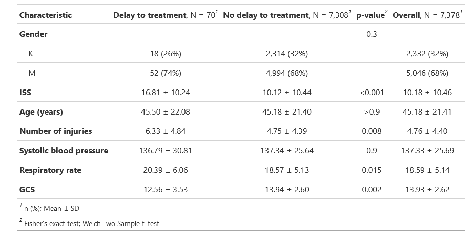

# Introduction

## Definition

Trauma, defined as the clinical entity composed of physical injury and
the body's associated response [@gerdin_risk_2015], is and has long been
a major cause of death around the world [@WHO_2021]. Within modern
hospital care, the trauma system stands as an important part in
healthcare and is crucial to lowering mortality and morbidity in injured
patients through many means, such as hospital care, patient follow up
and prevention programs [@Choi_2021].

## Trauma Statistics

Trauma is often divided into two subgroups, blunt force trauma and
penetrating trauma. Blunt force trauma is when an object or force
strikes the body, often causing bruising, broken bones or deep cuts.
Examples of blunt trauma could be car crashes, falls or direct blows to
the body. Penetrating trauma is when an object pierces the skin or body
and creates an open wound. Examples of penetrating trauma are gunshot
wounds and stab wounds [@NIGMS_2020]. Differences exist between the two
groups, as blunt trauma patients tend to be more injured on arrival to
the hospital and as such, require more resources and are hospitalized
for a longer periods [@FITCH2019].

Today, trauma takes the lives of around 4,4 million people each year,
almost 8% of all deaths [@WHO_2021]. In the United States, trauma is the
4th leading cause of death among the general population and the leading
cause for people between the ages of 1 and 44 [@AAST_2020]. It is also
an important cause of hospitalization and morbidity among all age
groups, including seniors, and is responsible for an estimated 10% of
all years lived with a disability globally. This has a significant
burden on social and economic level, costing countries billions of US
dollars each year in healthcare and lost productivity [@connolly_2018].
Studies estimate the cost of trauma care being between 18,500\$ and
41,500\$ per patient in high income countries (HIC), depending on the
country [@Willenberg_2012]. However, it has been shown that this burden
is not evenly distributed between or within countries. Many social
factors such as age, sex and social status play a major role in the risk
of dying from trauma, with young men with low socio-economic status
being at most risk [@WHO_2021]. But it is not only patient level factors
that affect what effect trauma has on people. About 90% of all trauma
related deaths occur in low- and middle-income countries (LMIC), with
death rates by trauma also being higher than in HIC. Even within these
LMIC, people of poorer socio-economic status have higher death rates
from trauma. Problems identified within these countries that contribute
to these statisitics were infrastructure, education and training,
attributed to lack of funding, brain drain to HIC and lack of
availability of basic amenities [@Shanthakumar_2021]. In HIC where
funding and governance over the healthcare system is better designed,
functioning trauma systems and dedicated trauma centers exist that have
been shown to lower mortality but also improve functional outcome in
trauma patients [@Nirula_2006].

## Trauma systems

Trauma systems are infrastructures that exist to provide and optimize
care for injured patients starting with injury recognition and triage,
transport to appropriate trauma center, inpatient care and outpatient
follow-up. Beyond the clinical side, trauma systems work with outreach,
education and advocacy, data collection through registries, research,
funding, and disaster preparedness and response. A comprehensive and
functioning trauma system requires strong leadership and engagement at
the trauma center, regional and national level [@connolly_2018]. This
system is crucial to provide care for trauma patients, both in reducing
morbidity and mortality in this patient group. Earlier studies from
Sweden have shown that treating severely injured patients at a trauma
center is associated with a 41% lower adjusted 30-day mortality rate
compared to being treated at a non trauma care center due to them being
more capable of treating these patients, with potential survival benefit
increasing with higher injury severity [@Candefjord_2020]. Other studies
have shown similar results, showing that treating injured patients at
trauma centers is associated with a 15-30% decrease in mortality
[@Moran_2018; @Celso_2006; @MacKenzie_2006; @Haas_2012] . During the
last three decades, the introduction of trauma systems has contributed
to lowering the incidence of preventable death . This is attributed to
the improvements in care for acute brain injuries and bleeding control.
The incidence of late death because of sepsis and multiple organ failure
has also been lowered, possibly a result of better and earlier
resuscitation [@Asensio_2008]. Functioning trauma systems saves lives in
the hospital, but their work outside of the hospital is just as
important. Data collection from injured patients, such as mechanism of
injury or mortality, are essential for creating databases that can be
used for research. In turn, that research can be used for planning
injury prevention programs that target the most common injuries in the
most efficient ways, e.g. teen drivers, children, specific occupations
etc. These injury prevention programs can be planned on trauma center,
organizational or government level[@ACS].

Trauma teams are multidisciplinary and operate in these centers. They
play a pivotal role in the treatment of the trauma patient, as they
provide the initial care in the critical stage of trauma. In Sweden,
trauma teams are lead by a team leader who is a surgeon, and include
practitioners from the specialities of intensive care, orthopedics,
nursing and support staff[@västra_G]. For the trauma team to be
mobilized, trauma code has to be activated, often by an emergency nurse.
The nurse uses information gathered by the first responders to assess if
the patient fits any of the criteria for trauma code. Most healthcare
facilities have established criteria or guidelines that trigger trauma
code activation. These criteria typically include mechanisms of injury,
physiological criteria, anatomical criteria and other specific
indicators of severe trauma. There are different levels of trauma code
with different criteria correlating with severity of injury, with level
1 mobilizing the most personnel to the trauma room. Once in the trauma
room, the team works systematically to manage the patients injuries.
They handle the most urgent problems first, such as airways and
breathing, with the aim to rapidly assess and stabilise the patient,
prioritise their injuries and arrange for site of definitive care.
[@Hedberg_2020]

## Mortality and morbidity (MoM) conferences

Many hospitals have a trauma registry where they log the patients
information and timeline of what happened. The extent of the registry
varies, with HIC having more complete registries. In Sweden, 48 out of
the 49 hospitals receiving trauma patients are connected to the national
registry SweTrau, which functions as a national database designed to
enable scientific processing with epidemiological technology
[@SweTrau_2021] This logging of information is important work, as a
cornerstone of trauma quality improvement programs is multidisciplinary
MoM conferences. The MoM conference is a meeting where different
specialities who work with trauma care sit down and discuss deaths and
complications in order to look for preventable factors. These
conferences are performed in many hospitals globally, almost everywhere
where there are formal medical specialty departments and sometimes in
smaller hospitals as well [@WHO_2009]. In Sweden, many hospitals have
mortality conferences on deceased patient cases, but only one has MoM
conferences to better their trauma care on patients who lived
[@SweTrau_2023]. The reason being that this expansion of MoM conferences
takes time and resources, which is why all hospitals don't implement
this.

The endpoint of these MoM conferences are opportunities for improvement
(OFI). At the end of the conference, consensus is reached regarding the
existence of an OFI and implementation of corrective action. This
process is effective, as it has been shown that this review is
associated with high-quality trauma care [@Santana_2014]. Examples of
OFI may include lack of resources and management errors. One common OFI
is delayed treatment. According to previous studies, among the
preventable or possibly preventable deaths in trauma patients, delay in
treatment has been identified as a major error contributing to death,
found in up to 52.9% of patients in said group [@Teixeira_2007]. Delayed
treatment has been shown to have adverse effects on patients, showing
why it is such an important issue and the need to develop strategies to
combat [@Sampalis_1995; @Sampalis_1994]. Although it is such a common
OFI, the patient level factors associated with delayed treatment are
poorly understood. There may be several factors that correlate with
receiving delayed treatment, but they have yet to be identified. Mapping
these factors may help in identifying patients that might be at risk for
receiving delayed treatment before it happens.

## Aim

The aim of this paper is to determine what different patient level
factors affect the risk of receiving delayed treatment at a trauma
center.

# Methods

## Setting

Karolinska University hospital, which is the equivalent of a trauma
level 1 hospital, admits 1500 trauma patients each year. To be added to
the trauma registry, a patient must be over 15 years of age, had ISS\>9
and/or had trauma code activation. They get added to both the Karolinska
Trauma registry as well as the national trauma registry (SweTrau). The
registry includes data on vital signs, injuries, interventions and
patient information. Another database, the trauma care quality database
includes information relevant for MoM conferences. At Karolinska
University Hospital, patients who die during hospital stay gets their
case sent to a MoM everytime. However, for the rest of the patients, two
specialized nurses determine whether they are. Several audit filters are
set up to flag for patients with possible OFIs. Flagged patients are
then reviewed by these two nurses who decide if there is a possible OFI,
in which case their case is sent to a MoM conference for further review.

## Study design

We conducted a registry based cohort study using data from the trauma
registry and trauma care quality database at the Karolinska University
Hospital in Solna. The trauma registry includes about 14,022 patients
treated between 2012 and 2022. The trauma care quality database is a
subset of the trauma registry and includes about 8000 patients selected
for review between 2013 and 2022. This project will link the two
databases and assess how different patient level factors, such as age,
sex, blood pressure, and injury severity, are associated with delayed
treatment using logistic regression.

## Outcome

The outcome is the ofi delayed treatment. An ofi is any failure in care,
e.g. clinical judgement error, any preventable or potentially
preventable death, missed diagnosis, technical error and delayed
treatment as identified and decided my the MoM conference. The outcomes
we'll be using is "long time until CT" and "long time until operation",
which will be referred to as delayed treatment from now on.

## Participants

The database only includes patients 15 years old and above, ISS \>9
and/or trauma team activation. Inclusion in the study further requires
that the patients have been assessed for OFIs. Patients were excluded if
they were missing information in one of the examined patient factors.

## Variables

The independent variables are gender, GCS on arrival, respiratory rate
on arrival, systolic blood pressure on arrival, number of injuries, ISS
and age. Of these variables, GCS, respiratory rate, systolic blood
pressure, number of injuries, ISS and age are used as continuous
variables in the analysis. Gender is used as a categorical variable.

For missing hospital values in GCS, RR and SBP, values from EMT
personnel were used. This was accomplished by identifying missing data
in the column for the hospital value of the variable and, if available,
replacing the row in the dataset with the prehospital value. If a
prehospital value is missing, the patient is excluded from the study.

## Data sources/measurement

The data comes from the trauma registry and trauma care quality
database.

## Bias

Selection bias as this is a retrospective cohort study where the outcome
has occurred.

Misclassification bias as the conference may reach a consensus that is
wrong.

## Study size

The study size is all of the eligible patients that was treated at the
hospital between 2012 and 2022. Starting 2013 only a subgroup of
patients were screened for OFIs, but starting 2017 all patients that are
included in the database are screened for OFIs. Out of the 14,022
patients in the database, 7,378 were included in the study, with the
rest being excluded due to either not being screened for ofi or missing
values in the examined variables. 72 patients were deemed to have
received delayed treatment. However, only 70 patients with the
registered outcome were included in the study due to missing values
among two of the patients.

## Statistical methods

Multivariable and univariable logistical regression. A 5% significance
level and 95% confidence levels will be used.

Rstudio was used to perform the logistical regression. The code was
written to clean and prepare the data from the database. The data was
processed to have the variables customized to fit into the logistical
regression model, such as making them into factors, renaming outcomes in
the database and replacing or removing unknown values. The variables
were either binary or continuous. This code was used on scrambled data
at first so to avoid selection bias as much as possible. When the code
was finished, it was run on the unscrambled data.

Using the one in ten rule, 7 independent variables were used for the
logistical regression given that we have 72 patients with delayed
treatment. The one in ten rule states that for every variable examined,
10 events are needed in the group. In this case, this means that because
we have 72 patients with the examined outcome, we can have 7 variables.

The logistical regression is run through Rstudio using the glm command.
To make the tables, the package gtsummary was used to visualize the
adjusted and unadjusted regression.

## Ethical considerations

Ethical permit is required and exists. The ethical review number is
2021-02541 and 2021-03531. An ethical problem that might be brought up
is the anonymity of the patients. In the registry, patients social
security number is present and could theoretically be used to identify
the patient in question. This will not be a problem though, as in the
analysis, the social security number is removed from the data before the
logistical regression is ran. Furthermore, the results will be presented
with patients grouped together, not individually. This will make it
impossible for anyone to identify patients. During the analysis, a VPN
was used to access the database to ensure that no data was leaked or
used for other purposes.

# Results

Out of the 14,022 patients receiving trauma care at Karolinska
University Hospital, 5,710 patients were not screened for ofi, which
excludes them from the study and leaves 8,312 patients that have been
screened for ofi.

As we were running the logistical regression, further were excluded from
the study due to missing data. Among the 8,312 patients screened for
ofi, 7,378 were included in the study. 934 patients were excluded from
the study due to missing values in one or more variables. This left us
with 70 patients in the delayed treatment group and 7,308 patients in
the no delay to treatment group. The flowchart below illustrates the
exclusion and inclusion of patients.

Below are the characteristics of the group used in the logistical
regression. Most of the patients were men, 68%, with that being a bit
higher in the delayed treatment group, 74%. The mean value for the ISS
score was 10.18, with that value being higher in the outcome group, at
16.81. The mean age of the patients was 45.18 years old, with it being
around the same in the delayed treatment group at 45.50. The mean number
of injuries among the delayed treatment patients was at 6.33, which is
higher than in the overall group at 4.76. The mean SBP was 137.33, with
a standard deviation of 25.69. Mean respiratory rate was 18.59 with it
being slightly higher in the outcome population at 20.39. Lastly, mean
GCS was 13.93, being lower among patients with delayed treatment at
12.56.

In the following table, the results from the second regression analysis
is displayed.

The odds ratio is calculated in the same way as the previous regression
model, as well as a 95% confidence interval. The p value is also shown.

The analysis shows that some variables seem to have a correlation with
patients receiving delayed treatment. ISS and respiratory rate both have
a trend that patient with higher values seem to have a lower incidence
of delayed treatment, both unadjusted and adjusted. GCS had the opposite
correlation, with lower GCS often having lower incidence of delayed
treatment, both unadjusted and adjusted. Number of injuries had the
correlation of higher number of injuries having lower incidence of
delayed treatment unadjusted, but that correlation was not seen when
adjusted for.

# Discussion

Key results

These results show that there seems to be a correlation between some
variables and the presence of delayed treatment. A higher GCS had a
correlation with delayed treatment while a lower ISS had the same
correlation. This suggests that a less injured and more awake patient
has a higher risk of receiving delayed treatment. Compared to previous a
previous study analysing the same data but with ofi as the outcome, this
result is surprising as that study came to the opposite result
[@Pat_factors]. This can possibly be explained by that the study looked
at all ofi, whereas this study concentrates on delayed treatment.
Delayed treatment might have this correlation because an injured and
unconscious patient might receive more attention at the hospital,
leading to fewer instances delays compared to a patient that seems less
injured.

Limitations

In this study, one of the limitations was the amount of people having
the recorded outcome being quite small, leading us into having to limit
the amount of variables we wanted to examine. Furthermore, the original
plan was to divide RR, SBP and GCS into revised trauma score (RTS)
categories, from 1-4. However, many of the RTS variables had few to no
patients with the observed outcome. This led to separation in the
logistical regression in these variables, referring to when an outcome
variable separates a predictor variable completely, which occurs when
the predictor is only associated with one outcome value [@OARC]. In the
case of these variables, it was only RTS 3 and 4 who had patients with
the observed outcome, which left RTS 1 and 2 with confidence intervals
of 0.00 to infinity. This way would have been the best way to examine
these variables, but as that wasn't possible with this group of
patients, we resorted to making these variables continuous.

The problem mentioned above with too few patients in the outcome group
made this into a post hoc analysis. As we didn't know the amount of
people who received delayed treatment when we handled the scrambled
data, we ran the code on the real data when we had too many variables
for the dataset. Therefore, we had to change the variables after having
seen the real data, making it a post hoc analysis. This could in theory
open up for possible selection bias, as we might choose variables which
give us results we are looking for. However, all the variables included
in the final analysis were already included in the first one. Variables
were only removed, not added after having seen the real data.

The biases that might have been present in this study would be selection
bias and misclassification bias. Selection bias I've explained above but
misclassification bias is something that we can't control in this study.
As previously mentioned, the possible existence of an ofi is decided
during the MoM conferences, where they then add it to the database.
However, they might not always be right in their judgement and
misclassify from time to time, leading to patients landing in the wrong
group in the analysis. This bias should not be big enough to have a
significant impact on the results, but should be kept in mind.

Interpretation

Give a cautious overall interpretation of results considering
objectives, limitations, multiplicity of analyses, results from similar
studies, and other relevant evidence

Generalisability

Discussing the generalisability of this study, we included the all the
trauma patients treated and Karolinska University Hospital and excluded
40.7% of that population based on that they had not been screened for
ofi. Additional patients were excluded because of missing data, but no
distinct groups except the not screened patients were removed. On that
basis, this population should be a general representation of trauma
patients at the equivalent of a level 1 trauma center, making this study
generalisable. This is in line with our aim, as it was to make it
applicable to the whole trauma patient population

Discuss the generalisability (external validity) of the study results
